# Vendor Intelligence Copilot

AI-powered vendor analysis system using a 5-layer RAG architecture with FastAPI, Streamlit, vector embeddings, and semantic retrieval.

---

## Demo Video

Watch a 5-minute walkthrough of the system architecture and features.

▶ **Watch the demo:**  

Click the image below to watch the full demo.

https://www.loom.com/share/4eea2f32e52240a9820d08ec1cdd3cb4


# Vendor Intelligence Copilot

An AI-powered vendor evaluation system that analyzes vendor contracts, SLAs, pricing models, and security documents using **Retrieval-Augmented Generation (RAG)**.

The system ingests vendor documents (PDF/TXT), stores them in a **vector database**, and enables **AI-driven decision intelligence** such as vendor comparison, risk analysis, scoring, and recommendations.

---

# Project Overview

Organizations often evaluate multiple vendors using contracts, SLAs, pricing documents, and security reports. Manually reviewing these documents is slow and error-prone.

Vendor Intelligence Copilot automates this process using **LLMs and semantic retrieval**, allowing decision-makers to ask natural language questions and receive structured insights.

---
## Project Structure

```text
vendor-intelligence-copilot/
│
├── app/
│   ├── api/
│   ├── core/
│   ├── services/
│   └── ...
│
├── ui/
│   └── app.py
│
├── assets/
│   ├── architecture/
│   ├── upload/
│   ├── dashboard/
│   ├── comparison/
│   ├── risk/
│   └── recommendation/
│
├── data/
├── requirements.txt
└── README.md
```

# System Architecture

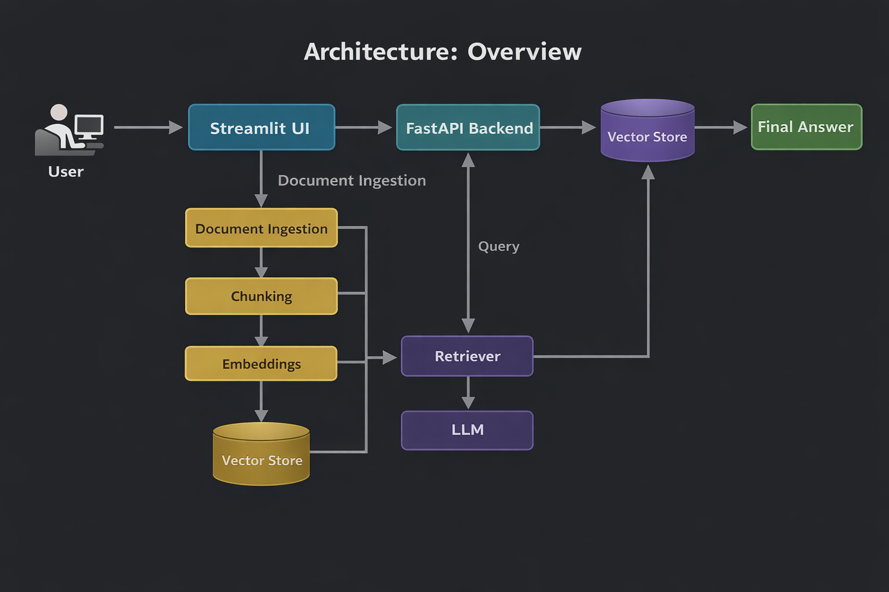

Pipeline:

User → Streamlit UI → FastAPI Backend → RAG Pipeline → Qdrant Vector Database → LLM (Ollama / OpenAI)

---

# Key Features

• Vendor document ingestion (PDF / TXT)

• Semantic vector search using embeddings

• Metadata-aware vendor filtering

• Vendor comparison engine

• AI-driven vendor risk analysis

• Vendor scoring system

• AI recommendation engine

• Interactive Streamlit analytics dashboard

## System Workflow

### Document Ingestion
1. User uploads vendor PDFs through the Streamlit interface.
2. Documents are processed by the FastAPI backend.
3. Content is chunked into smaller text segments.
4. Embeddings are generated for each chunk.
5. Embedded chunks are stored in a vector store for retrieval.

### Query and Reasoning
1. User asks a vendor-related question.
2. The backend retrieves relevant chunks from the vector store.
3. Retrieved context is passed into the LLM.
4. The system generates a structured answer for:
   - vendor comparison
   - risk analysis
   - recommendation
---
## Application Screenshots

# Dashboard

## Dashboard Overview
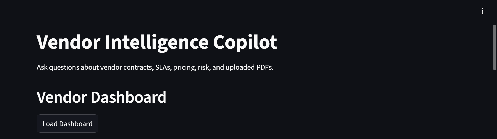

## Vendor Metrics
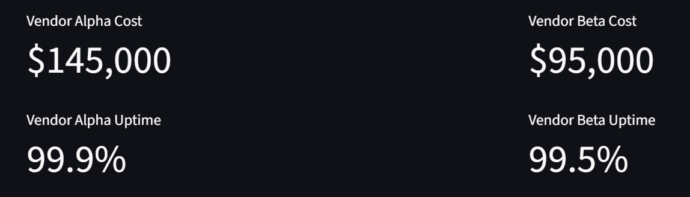

## Vendor Summary Table
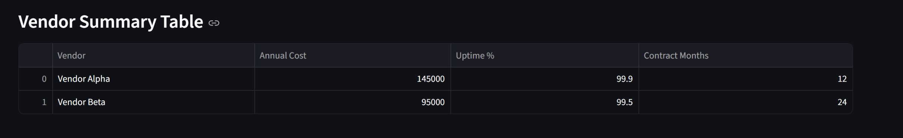

## Vendor Analytics Charts
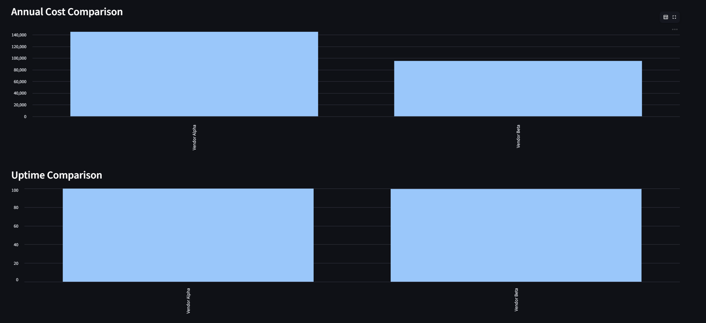

## Risk & Recommendation Section
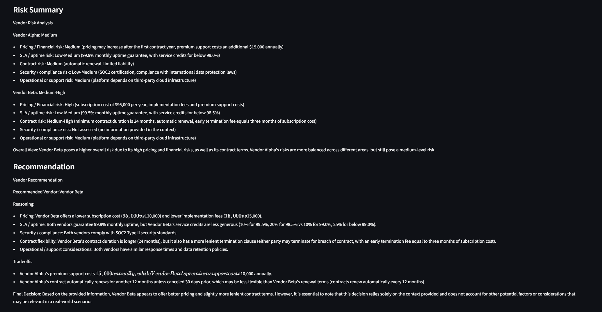

---

# Vendor Comparison

Ask the system to compare vendors across pricing, SLAs, and contracts.

Example query:

Compare Vendor Alpha and Vendor Beta pricing

### Vendor Comparison Mode
**Comparison Query Input**
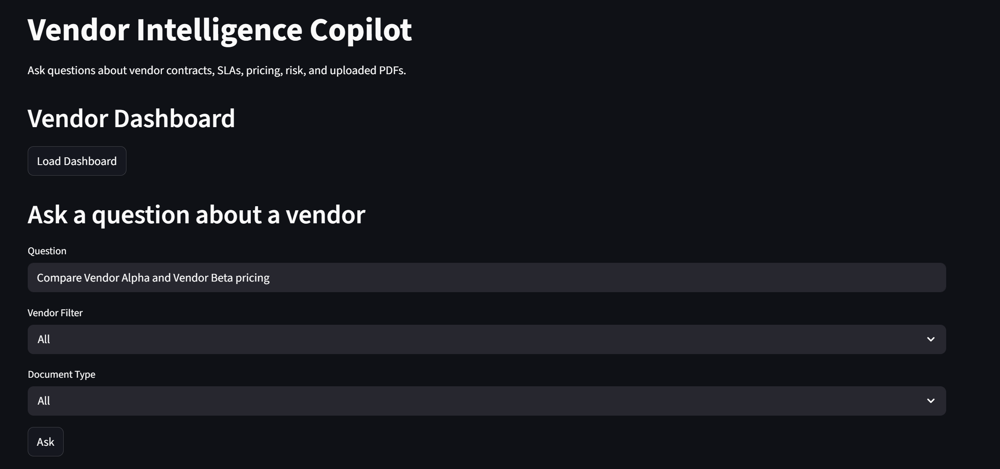

**Comparison Answer**
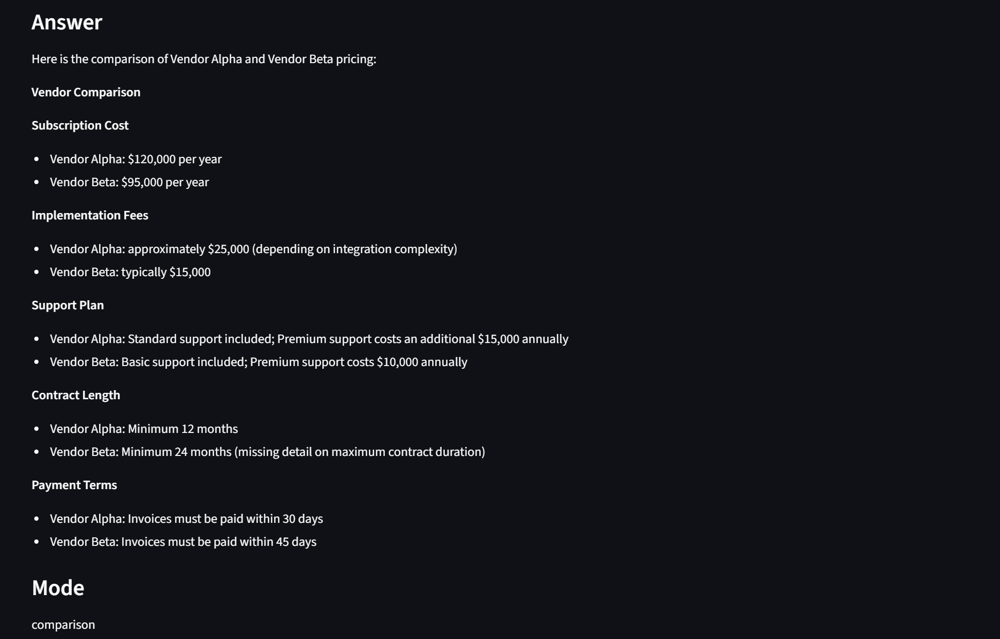

# Risk Analysis

The system can analyze vendor risk using contract clauses and SLA guarantees.

Example query:

Analyze the risk of Vendor Alpha and Vendor Beta
### Risk Analysis Mode

**Risk Query Input**


**Risk Analysis Answer**
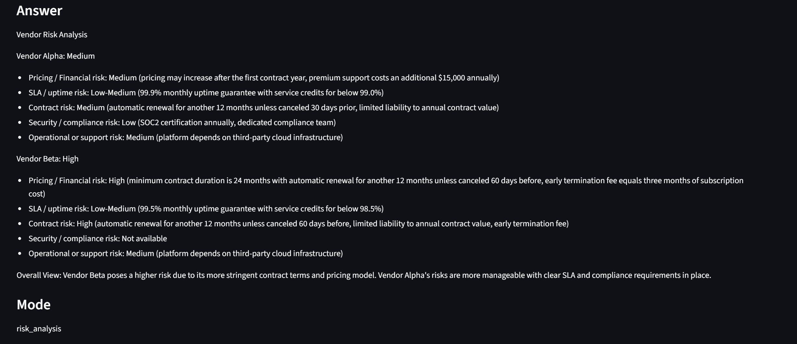


# AI Recommendation Engine

The system generates a structured recommendation for vendor selection.

Example query:

Which vendor should we choose?
### Recommendation Mode

**Recommendation Query Input**
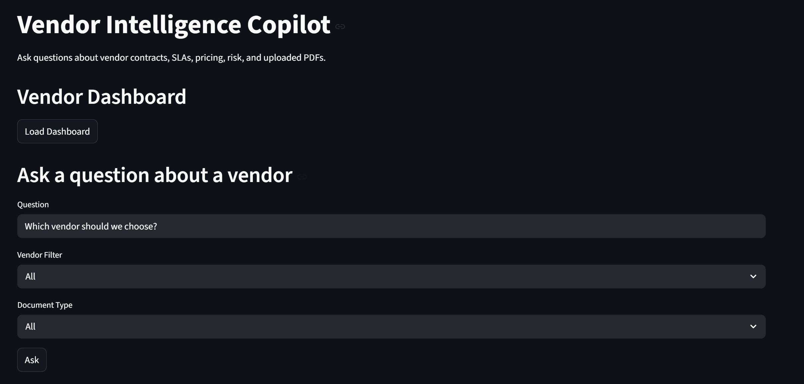

**Recommendation Answer**
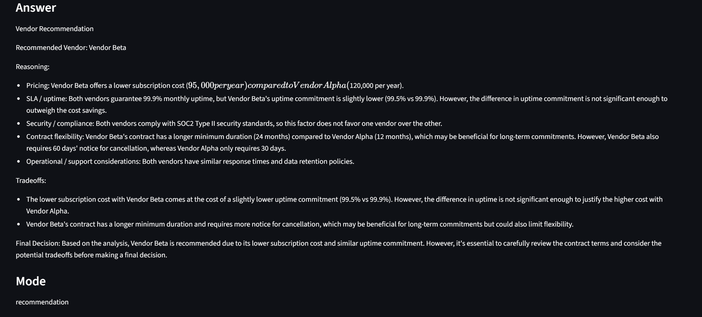


# Document Upload & Ingestion

Users can upload vendor documents which are automatically parsed and indexed in the vector database.

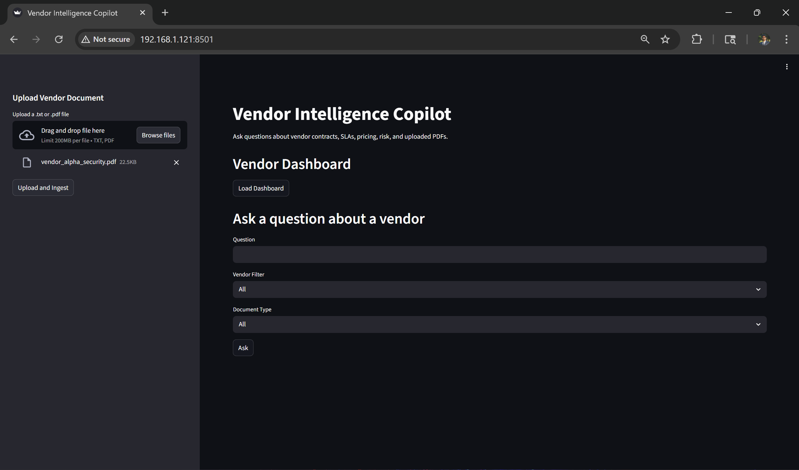

After ingestion, documents are chunked, embedded, and stored for retrieval.

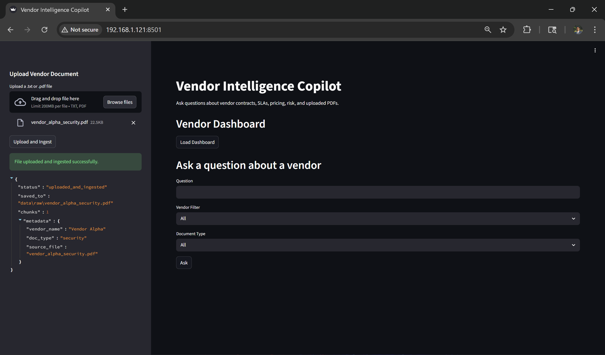

---

# Example Questions

The system can answer questions such as:

• What uptime does Vendor Beta guarantee?

• Compare Vendor Alpha and Vendor Beta pricing

• What security certifications does Vendor Alpha have?

• Analyze the risk of Vendor Alpha and Vendor Beta

• Score Vendor Alpha and Vendor Beta

• Which vendor should we choose?

---

# Technology Stack

**Language**

Python

**Backend**

FastAPI

**Frontend**

Streamlit

**AI Frameworks**

LangChain

**Vector Database**

Qdrant

**LLM Providers**

Ollama  
OpenAI API

**Infrastructure Ready**

Docker  
Kubernetes

---

# How the System Works

1. Vendor documents are uploaded through the Streamlit interface.

2. Documents are parsed and chunked using LangChain text splitters.

3. Each chunk is converted into embeddings.

4. Embeddings are stored in a Qdrant vector database.

5. User queries trigger semantic retrieval.

6. Relevant document chunks are sent to the LLM.

7. The LLM generates structured responses for:

• comparison  
• risk analysis  
• scoring  
• recommendations  

---

# Running the Project Locally

Clone the repository:

```bash

git clone https://github.com/madhukargoli1992G/vendor-intelligence-copilot
cd vendor-intelligence-copilot

#Install dependencies: 
pip install -r requirements.txt

#Start the backend API:
uvicorn app.api.main:app --reload

#Run the Streamlit interface:
streamlit run ui/app.py

```

### Project Highlights

• Built a Retrieval-Augmented Generation (RAG) pipeline for vendor document intelligence

• Implemented metadata-aware semantic retrieval for vendor-specific queries

• Developed AI-driven vendor risk analysis and scoring system

• Created decision-support recommendation engine using LLM reasoning

• Built an interactive analytics dashboard for vendor evaluation

### Future Improvements

• Multi-agent vendor evaluation system

• Automated vendor scoring pipeline

• Contract clause extraction

• Vendor financial risk modeling

• Production deployment pipeline